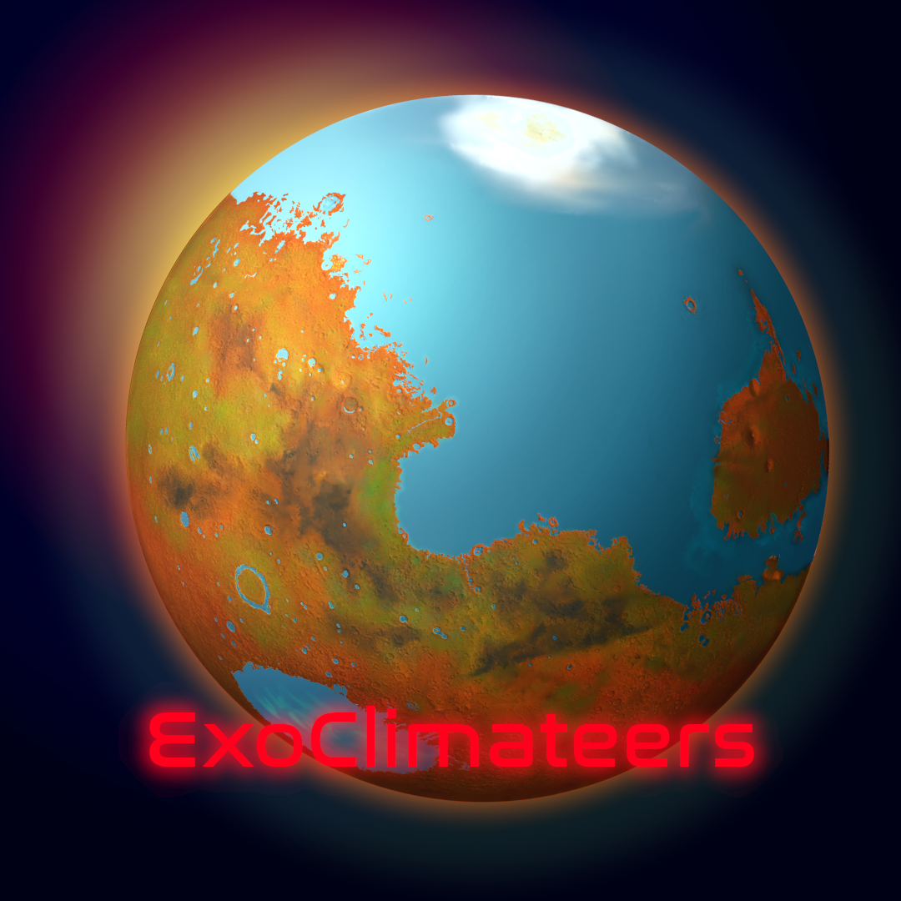

# ExoClimateers @ YorkU

We are a group of 'ExoClimateers', explorers of distant skies! Based out of the Physics & Astronomy department of York University in Toronto, Canada; our team led by Dr. Sarah Rugheimer investigates the habitability exoplanets; primarily of the Earth analogue variety; through a broad parameter space when it comes to atmospheric dynamics and enery balance.

